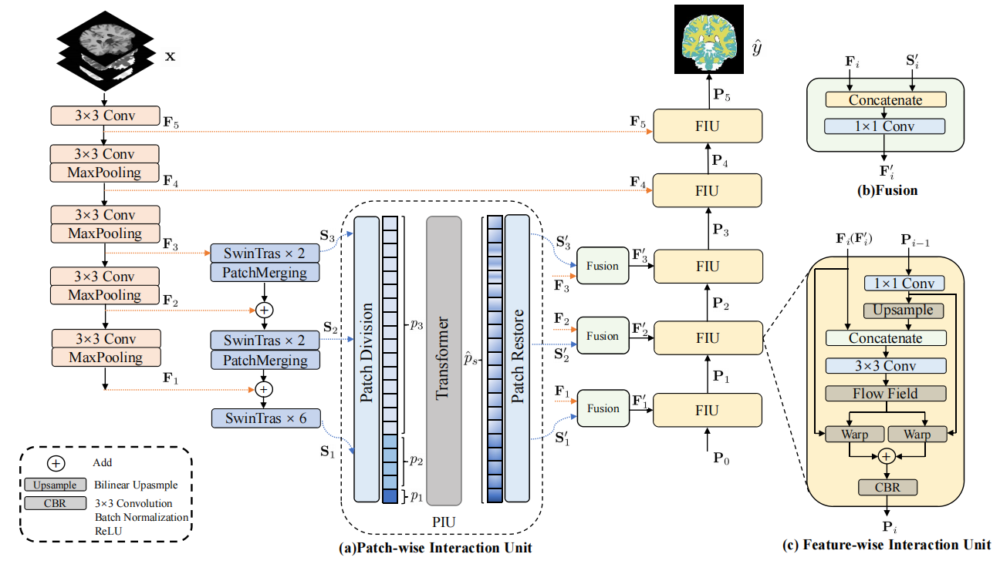

### CSFINet
This repository includes the official project of CSFINet, presented in our paper: CSFINet: Cross-scale Feature Interaction For Medical Image Segmentation

### Usage
models/ : CSFINet model

loader/ : image data pre-processing

loss/ : Some settings of the loss function

configs/ : Selection of models and datasets

dataset_down.txt: You can choose from the download links we provide to download

you can run the train.py and test.py for training and testing.

### Environment
Please prepare an environment with python=3.7, and then use the command "pip install -r requirements.txt" for the dependencies.

<!--
**CSFINet/CSFINet** is a ✨ _special_ ✨ repository because its `README.md` (this file) appears on your GitHub profile.

Here are some ideas to get you started:

- 🔭 I’m currently working on ...
- 🌱 I’m currently learning ...
- 👯 I’m looking to collaborate on ...
- 🤔 I’m looking for help with ...
- 💬 Ask me about ...
- 📫 How to reach me: ...
- 😄 Pronouns: ...
- ⚡ Fun fact: ...
-->
